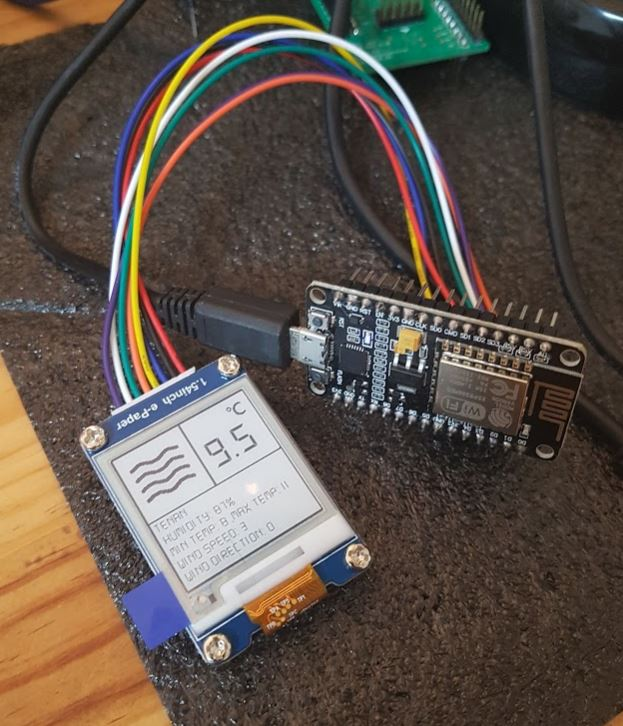

# ESP8266_EPAPER_WEATHER
Weather information using OpenWeatherMap API + GxEPD library

[Tutorial] 
https://blog.naver.com/eziya76/221383648179 

1. References
- GxEPD library from https://github.com/ZinggJM/GxEPD  
- Adafruit GFX library from https://github.com/adafruit/Adafruit-GFX-Library  
- ArduinoJson library from https://github.com/bblanchon/ArduinoJson  

2. Tools & Others
 - Used OpenWeatherMap API service (https://openweathermap.org/)  
 - Used Sloeber IDE (http://eclipse.baeyens.it/)  
 - Weather icons are downloaded from https://www.flaticon.com/  
 - Added DS-DIGIT fonts to Adafruit GFX library.  
 
 3. H/W
 - ESP8266 NodeMCU V2  
 - Waveshare 1.54" E-PAPER DISPLAY  
 
 
